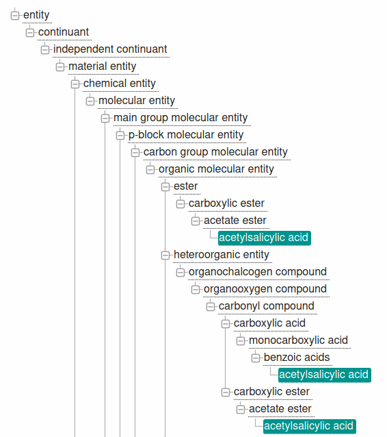

# PubChem

PubChem is the world's largest collection of freely accessible chemical information.

## Exploring

Go to PubChem: https://pubchem.ncbi.nlm.nih.gov/

Look for: `acetylsalicylic acid`

It is possible to do the same search on PubChem through an API. The details are here:

https://pubchemdocs.ncbi.nlm.nih.gov/pug-rest-tutorial

Let us build an API request using the popular name aspirin:

https://pubchem.ncbi.nlm.nih.gov/rest/pug/compound/name/aspirin/XML

Retrieving from its PubChem code (2244):
https://pubchem.ncbi.nlm.nih.gov/rest/pug/compound/cid/2244/XML

Retrieving its synonyms:
https://pubchem.ncbi.nlm.nih.gov/rest/pug/compound/cid/2244/synonyms/XML

Retieving a substance related to Acetylsalicylic Acid whose code is 49854366. It is described here:

https://pubchem.ncbi.nlm.nih.gov/substance/49854366

It is possible to retrieve data from this substance with the REST request:

https://pubchem.ncbi.nlm.nih.gov/rest/pug/substance/sid/49854366/XML

This substance will be used as an example in the following queries.

## TXQueryEngine

Since TXQueryEngine requires copy and paste straight from the result, the file was downloaded and is available here:

https://github.com/santanche/lab2learn/blob/master/data/pubchem/pubchem-acetylsalicylic-acid.xml

# Basics

The following queries will be tested on https://www.videlibri.de/cgi-bin/xidelcgi

Fetching the XML file:

Synonyms of aspirin:
~~~xquery
//PC-Substance_synonyms_E
~~~

How many synonyms?

~~~xquery
count(//PC-Substance_synonyms_E)
~~~

One per line:

~~~xquery
for $a in (//PC-Substance_synonyms_E)
return $a/text()
~~~

It is possible to request to PubChem all compounds whose structure is related to Acetylsalicylic Acid (2244) in the following way:

https://pubchem.ncbi.nlm.nih.gov/rest/pug/compound/fastsubstructure/cid/2244/cids/XML

## Accessing PubChem from Python

This code is read and processed through Python in this notebook:

https://github.com/santanche/lab2learn/blob/master/api/pubchem/pubchem-api.ipynb

# DRON - The Drug Ontology

A simplified version of DRON in XML can be found here:
[DRON in XML](https://github.com/santanche/lab2learn/blob/master//data/faers-2017-dron/dron.xml)

Each element `<drug>` represents a drug or drug classification (group). When a drug is part of a classification its `<drug>` element is subordinated to the classification. It produces a hierarchy as further illustrated.

## Exploring

Go to the Ontology Search related to DRON Ontology: https://www.ebi.ac.uk/ols/ontologies/dron

Look for: `acetylsalicylic acid`

The tree view will look like this:

# Basics

The following queries will be tested on https://www.videlibri.de/cgi-bin/xidelcgi

Name of all the classifications one level up (direct parents) of `Acetylsalicylic Acid` (with repetitions).

~~~xquery
//drug[drug/@name="ACETYLSALICYLIC ACID"]/@name
~~~

Same as the previous query, but iterating each classification element in a FOR.

~~~xquery
for $d in (//drug[drug/@name="ACETYLSALICYLIC ACID"])
return data($d/@name)
~~~

Using the GROUP BY clause to avoid repetitions.

~~~xquery
for $d in (//drug[drug/@name="ACETYLSALICYLIC ACID"])
let $gr := $d/@name
group by $gr
return data($gr)
~~~

Expanding to all levels up of classification, i.e., all (parent) classifications related to `Acetylsalicylic Acid` (paths from the `Acetylsalicylic Acid` to the root), without repetition.

~~~xquery
for $d in (//drug[drug//@name="ACETYLSALICYLIC ACID"])
let $parent := $d/@name
group by $parent
order by $parent
return data($parent)
~~~

# Integrating PubChem to DRON

A list of all PubChem elements that have cross-reference with ChEBI was retrieved by the REST call:

https://pubchem.ncbi.nlm.nih.gov/rest/pug/substance/sourceall/ChEBI/xrefs/RegistryID/XML

The result of this call was materialized at:

https://raw.githubusercontent.com/santanche/lab2learn/master/data/pubchem/pubchem-chebi.xml

The following XQuery fetches the list and displays the ChEBI codes. It uses substring to remove the CHEBI prefix, maintaining only the code:

~~~xquery
let $pubchem := doc('https://raw.githubusercontent.com/santanche/lab2learn/master/data/pubchem/pubchem-chebi.xml')
for $p in ($pubchem//RegistryID)
return substring($p/text(), 7)
~~~

## JOIN

The following code does a JOIN between the previous list, retrieved from PubChem and compounds in DRON. It adds a URI prefix to be compatible with the DRON approach of defining the code:

~~~xquery
let $pubchem := doc('https://raw.githubusercontent.com/santanche/lab2learn/master/data/pubchem/pubchem-chebi.xml')
let $dron := doc('https://raw.githubusercontent.com/santanche/lab2learn/master/data/faers-2017-dron/dron.xml')
for $p in ($pubchem//RegistryID),
    $d in ($dron//drug)
where concat('http://purl.obolibrary.org/obo/CHEBI_',substring($p/text(), 7)) = $d/@id
let $gr := $d/@name
group by $gr
order by $gr
return {data($gr), '&#xa;'}
~~~

# Enriching XML with Python

Departing from the list of all PubChem elements that have cross-reference with ChEBI, produced previously, it is possible to produce an XML file with the SIDs (PubChem) of the substances that appears in both:

~~~xquery
let $pubchem := doc('https://raw.githubusercontent.com/santanche/lab2learn/master/data/pubchem/pubchem-chebi.xml')
let $dron := doc('https://raw.githubusercontent.com/santanche/lab2learn/master/data/faers-2017-dron/dron.xml')
return
<PUBCHEM_DRON>
{for $p in ($pubchem//Information),
    $d in ($dron//drug)
where concat('http://purl.obolibrary.org/obo/CHEBI_',substring($p/RegistryID/text(), 7)) = $d/@id
let $gr := $p/SID/text()
group by $gr
order by $gr
return <SID>{data($gr)}</SID>
}</PUBCHEM_DRON>
~~~

In the following notebook, there is a code that produces a REST request for each id to retrieve synonym names from PubChem. It illustrates how to explore Python to enrich XML resources.

https://github.com/santanche/lab2learn/blob/master/api/pubchem/pubchem-api.ipynb
